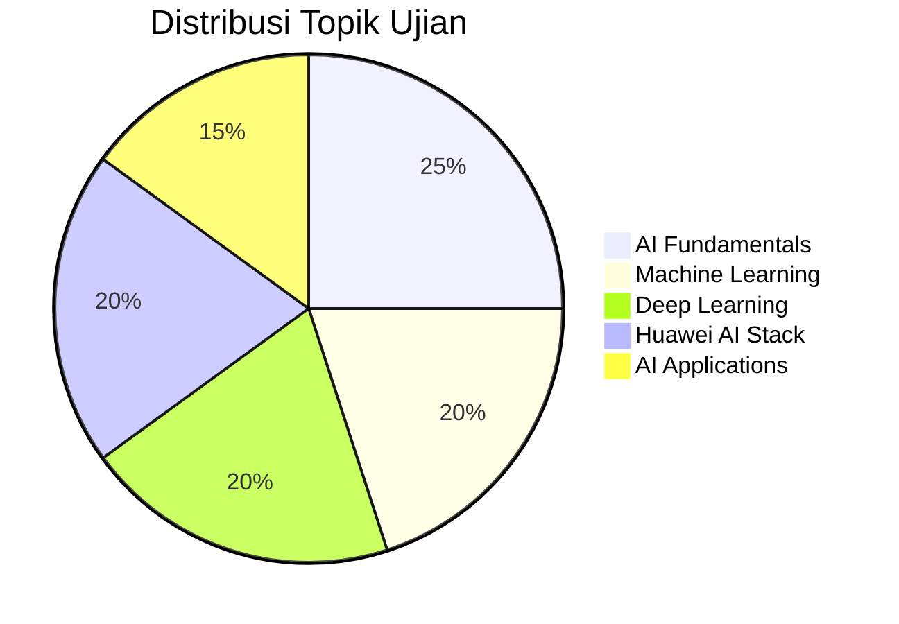

# HCIA-AI Certification Guide

## Overview Sertifikasi

HCIA-AI (Huawei Certified ICT Associate - Artificial Intelligence) adalah sertifikasi entry-level yang memvalidasi pemahaman fundamental tentang teknologi AI dan ekosistem Huawei AI.

## Target Audience

### Siapa yang Cocok?
- **Developers** yang ingin memahami AI development
- **IT Professionals** yang bergerak ke bidang AI
- **Students** dalam bidang computer science
- **Business Analysts** yang bekerja dengan AI projects
- **Technical Sales** yang fokus pada AI solutions

## Exam Structure

### Format Ujian
| Aspek | Detail |
|-------|--------|
| **Durasi** | 90 menit |
| **Jumlah Soal** | 60 pertanyaan |
| **Format** | Multiple choice, Multiple select, True/False |
| **Passing Score** | 600/1000 |
| **Bahasa** | English, Chinese |
| **Delivery** | Pearson VUE |

### Bobot Materi


## Syllabus Detail

### 1. AI Fundamentals (25%)

#### 1.1 Introduction to AI
- Definisi dan sejarah AI
- Tipe AI: Narrow vs General AI
- AI vs ML vs DL relationships
- AI application scenarios

#### 1.2 AI Development Process
```python
# Typical AI Development Workflow
stages = [
    "Problem Definition",
    "Data Collection",
    "Data Preprocessing", 
    "Model Selection",
    "Training",
    "Evaluation",
    "Deployment",
    "Monitoring"
]

for stage in stages:
    print(f"Stage: {stage}")
```

#### 1.3 AI Ethics dan Challenges
- **Bias dalam AI**: Sumber dan mitigasi
- **Privacy concerns**: Data protection
- **Transparency**: Explainable AI
- **Safety**: AI safety principles

### 2. Machine Learning (20%)

#### 2.1 Types of Machine Learning

##### Supervised Learning
- **Classification**: Prediksi kategori
- **Regression**: Prediksi nilai kontinyu

```python
# Classification example
from sklearn.ensemble import RandomForestClassifier
from sklearn.model_selection import train_test_split

# Prepare data
X_train, X_test, y_train, y_test = train_test_split(
    features, labels, test_size=0.2, random_state=42
)

# Train model
clf = RandomForestClassifier(n_estimators=100)
clf.fit(X_train, y_train)

# Evaluate
accuracy = clf.score(X_test, y_test)
print(f"Accuracy: {accuracy:.2f}")
```

##### Unsupervised Learning
- **Clustering**: K-means, Hierarchical
- **Dimensionality Reduction**: PCA, t-SNE
- **Association Rules**: Market basket analysis

##### Reinforcement Learning
- **Agent-Environment interaction**
- **Reward-based learning**
- **Q-learning basics**

#### 2.2 Model Evaluation
| Metric | Use Case | Formula |
|--------|----------|---------|
| **Accuracy** | Balanced datasets | (TP+TN)/(TP+TN+FP+FN) |
| **Precision** | False positives costly | TP/(TP+FP) |
| **Recall** | False negatives costly | TP/(TP+FN) |
| **F1-Score** | Balanced precision/recall | 2×(Precision×Recall)/(Precision+Recall) |

### 3. Deep Learning (20%)

#### 3.1 Neural Networks Basics
```python
# Simple neural network structure
import torch.nn as nn

class SimpleNN(nn.Module):
    def __init__(self, input_size, hidden_size, output_size):
        super(SimpleNN, self).__init__()
        self.hidden = nn.Linear(input_size, hidden_size)
        self.relu = nn.ReLU()
        self.output = nn.Linear(hidden_size, output_size)
        
    def forward(self, x):
        x = self.hidden(x)
        x = self.relu(x)
        x = self.output(x)
        return x
```

#### 3.2 CNN (Convolutional Neural Networks)
- **Konvolusi operation**
- **Pooling layers**
- **Applications**: Image classification, object detection

#### 3.3 RNN (Recurrent Neural Networks)
- **LSTM**: Long Short-Term Memory
- **GRU**: Gated Recurrent Unit
- **Applications**: NLP, time series

#### 3.4 Training Process
- **Forward propagation**
- **Backpropagation**
- **Gradient descent optimization**
- **Regularization techniques**

### 4. Huawei AI Stack (20%)

#### 4.1 MindSpore Framework
```python
# MindSpore basic workflow
import mindspore as ms
from mindspore import nn, Model
from mindspore.train.callback import ModelCheckpoint

# Define network
class LeNet5(nn.Cell):
    def __init__(self, num_class=10):
        super(LeNet5, self).__init__()
        self.conv1 = nn.Conv2d(1, 6, 5, pad_mode='valid')
        self.conv2 = nn.Conv2d(6, 16, 5, pad_mode='valid')
        self.fc1 = nn.Dense(16*5*5, 120)
        self.fc2 = nn.Dense(120, 84)
        self.fc3 = nn.Dense(84, num_class)
        self.relu = nn.ReLU()
        self.max_pool2d = nn.MaxPool2d(kernel_size=2, stride=2)
        self.flatten = nn.Flatten()

    def construct(self, x):
        x = self.conv1(x)
        x = self.relu(x)
        x = self.max_pool2d(x)
        x = self.conv2(x)
        x = self.relu(x)
        x = self.max_pool2d(x)
        x = self.flatten(x)
        x = self.fc1(x)
        x = self.relu(x)
        x = self.fc2(x)
        x = self.relu(x)
        x = self.fc3(x)
        return x

# Create model
network = LeNet5()
model = Model(network)
```

#### 4.2 Ascend Computing
- **Ascend 910**: Training acceleration
- **Ascend 310**: Inference optimization
- **CANN**: Compute Architecture for Neural Networks

#### 4.3 ModelArts Platform
- **Data management**: Labeling, preprocessing
- **Training jobs**: Distributed training
- **Model management**: Versioning, registry
- **Deployment**: Real-time, batch inference

### 5. AI Applications (15%)

#### 5.1 Computer Vision
- **Image Classification**
- **Object Detection**: YOLO, R-CNN
- **Semantic Segmentation**
- **Face Recognition**

#### 5.2 Natural Language Processing
- **Text Classification**
- **Machine Translation**
- **Sentiment Analysis**
- **Question Answering**

#### 5.3 Speech Processing
- **Speech Recognition** (ASR)
- **Text-to-Speech** (TTS)
- **Voice Assistant**

## Study Materials

### Official Resources
1. **Huawei HCIA-AI Training Materials**
2. **MindSpore Documentation**
3. **ModelArts User Guide**
4. **Ascend Developer Documentation**

### Recommended Books
- "Hands-On Machine Learning" by Aurélien Géron
- "Deep Learning" by Ian Goodfellow
- "Pattern Recognition and Machine Learning" by Christopher Bishop

### Online Courses
- Huawei Talent Online HCIA-AI Course
- Coursera Machine Learning Course
- Fast.ai Practical Deep Learning

## Preparation Timeline

### 8-Week Study Plan

#### Week 1-2: AI Fundamentals
- [ ] AI history dan definitions
- [ ] ML vs DL concepts
- [ ] AI ethics dan challenges
- [ ] Practice: Basic terminology quiz

#### Week 3-4: Machine Learning
- [ ] Supervised learning algorithms
- [ ] Unsupervised learning techniques
- [ ] Model evaluation metrics
- [ ] Practice: Implement basic ML models

#### Week 5-6: Deep Learning
- [ ] Neural network fundamentals
- [ ] CNN architecture
- [ ] RNN dan variants
- [ ] Practice: Build simple neural networks

#### Week 7: Huawei AI Stack
- [ ] MindSpore framework
- [ ] Ascend computing platform
- [ ] ModelArts workflow
- [ ] Practice: MindSpore tutorials

#### Week 8: AI Applications & Review
- [ ] Computer vision applications
- [ ] NLP use cases
- [ ] Speech processing
- [ ] Practice: Mock exams

## Hands-on Labs

### Lab 1: Data Preprocessing
```python
import pandas as pd
from sklearn.preprocessing import StandardScaler, LabelEncoder

# Load data
df = pd.read_csv('dataset.csv')

# Handle missing values
df.fillna(df.mean(), inplace=True)

# Encode categorical variables
le = LabelEncoder()
df['category'] = le.fit_transform(df['category'])

# Scale numerical features
scaler = StandardScaler()
df[['feature1', 'feature2']] = scaler.fit_transform(df[['feature1', 'feature2']])
```

### Lab 2: Model Training dengan MindSpore
```python
import mindspore.dataset as ds
from mindspore import nn, Model
from mindspore.train.callback import LossMonitor

# Prepare dataset
def create_dataset(data_path, batch_size=32):
    dataset = ds.MnistDataset(data_path)
    dataset = dataset.map(operations=[vision.Rescale(1.0/255.0, 0.0)], input_columns="image")
    dataset = dataset.map(operations=[transforms.TypeCast(mstype.int32)], input_columns="label")
    dataset = dataset.batch(batch_size, drop_remainder=True)
    return dataset

# Train model
train_dataset = create_dataset('train', batch_size=64)
network = LeNet5()
loss = nn.SoftmaxCrossEntropyWithLogits(sparse=True, reduction='mean')
optimizer = nn.Adam(network.trainable_params(), learning_rate=0.001)

model = Model(network, loss, optimizer, metrics=['accuracy'])
model.train(10, train_dataset, callbacks=[LossMonitor()])
```

## Tips Ujian

### Strategi Menjawab
1. **Baca pertanyaan dengan teliti**
2. **Eliminasi jawaban yang jelas salah**
3. **Gunakan logical reasoning**
4. **Manage waktu dengan baik** (1.5 menit per soal)

### Common Pitfalls
- Mengabaikan detail dalam scenario questions
- Tidak memahami perbedaan antar algoritmi ML
- Kurang familiar dengan MindSpore syntax
- Tidak memahami use cases untuk different AI techniques

## Mock Exam Questions

### Sample Questions

**Q1:** Which of the following is NOT a characteristic of Deep Learning?
A) Requires large datasets
B) Uses neural networks with multiple layers  
C) Always performs better than traditional ML
D) Automatically extracts features

**Answer:** C

**Q2:** In MindSpore, which mode is used for dynamic graph execution?
A) GRAPH_MODE
B) PYNATIVE_MODE
C) DYNAMIC_MODE
D) EAGER_MODE

**Answer:** B

### Practice Tests
- 20 questions covering each domain
- Timed practice sessions
- Explanation untuk setiap jawaban
- Progress tracking

---

**Good luck dengan preparation HCIA-AI certification! 🚀**

*Remember: Practice makes perfect. Focus on understanding concepts rather than memorizing facts.* 