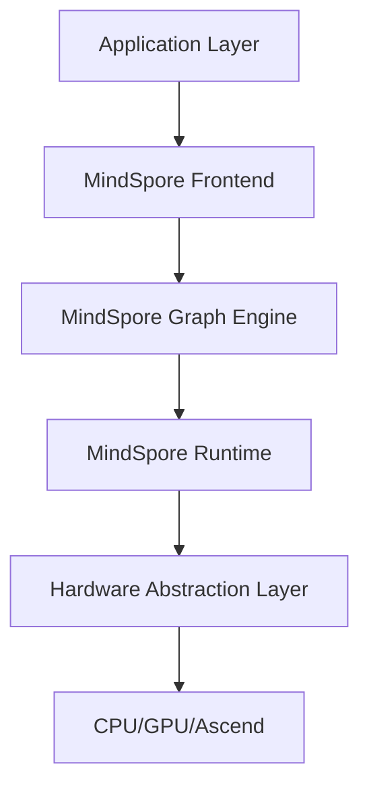

# Huawei AI Framework

## Overview

Huawei telah mengembangkan ekosistem AI yang komprehensif yang mencakup hardware, software, dan cloud services untuk mendukung pengembangan dan deployment aplikasi AI di berbagai skala.

## MindSpore Framework

### Apa itu MindSpore?

MindSpore adalah framework deep learning open source yang dikembangkan oleh Huawei untuk memfasilitasi development, training, dan deployment model AI. Framework ini dirancang untuk memberikan pengalaman pengembangan yang unified across different scenarios.

### Fitur Utama MindSpore

#### 1. Unified API
```python
import mindspore as ms
from mindspore import nn, ops, Tensor
import numpy as np

# Definisi model sederhana
class LinearNet(nn.Cell):
    def __init__(self):
        super(LinearNet, self).__init__()
        self.linear = nn.Dense(1, 1)
    
    def construct(self, x):
        return self.linear(x)

# Inisialisasi model
model = LinearNet()
```

#### 2. Automatic Differentiation
- **Reverse Mode AD**: Efisien untuk neural networks
- **Forward Mode AD**: Optimal untuk scientific computing
- **Hybrid Mode**: Kombinasi kedua mode

#### 3. Graph dan Eager Execution
```python
# Graph mode (default)
@ms.jit
def train_step(inputs, targets):
    def forward_fn():
        predictions = model(inputs)
        loss = loss_fn(predictions, targets)
        return loss
    
    grad_fn = ms.value_and_grad(forward_fn, None, model.parameters())
    loss, grads = grad_fn()
    optimizer(grads)
    return loss

# Eager mode
ms.set_context(mode=ms.PYNATIVE_MODE)
```

### Arsitektur MindSpore



## Ascend Chipset

### Arsitektur Ascend

Ascend adalah keluarga chipset AI yang dikembangkan Huawei untuk accelerated computing dalam training dan inference AI models.

#### Ascend 910
- **Training-focused**: Dioptimalkan untuk training model besar
- **Performance**: 256 TOPS @ INT8
- **Memory**: HBM2 32GB
- **Interconnect**: High-speed chip-to-chip communication

#### Ascend 310
- **Inference-focused**: Dioptimalkan untuk deployment production
- **Power Efficiency**: 8 TOPS/W
- **Deployment**: Edge dan cloud scenarios

### Programming Model

```python
# Contoh deployment pada Ascend
import mindspore as ms
from mindspore import Model
from mindspore.train import CheckpointConfig, ModelCheckpoint

# Set context untuk Ascend
ms.set_context(mode=ms.GRAPH_MODE, device_target="Ascend")

# Load pre-trained model
model = Model(network)

# Training dengan Ascend acceleration
config_ck = CheckpointConfig(
    save_checkpoint_steps=1000,
    keep_checkpoint_max=5
)
ckpoint = ModelCheckpoint(prefix="resnet", config=config_ck)

model.train(epoch_size, dataset, callbacks=[ckpoint])
```

## Huawei Cloud AI Services

### ModelArts

ModelArts adalah full-lifecycle AI development platform yang menyediakan:

- **Data Labeling**: Tools untuk annotation dataset
- **Model Training**: Distributed training capabilities
- **Model Management**: Version control dan model registry
- **Model Deployment**: One-click deployment ke production

### HiLens

Platform untuk edge AI development:

```yaml
# HiLens skill configuration
apiVersion: hilens/v1
kind: Skill
metadata:
  name: object-detection-skill
spec:
  model:
    source: "modelarts://object-detection-model/1.0"
    framework: "mindspore"
  runtime:
    language: "python3.7"
    handler: "index.inference"
```

## CANN (Compute Architecture for Neural Networks)

### Komponen CANN

1. **AscendCL**: C/C++ API untuk Ascend computing
2. **Graph Engine**: Optimized graph execution
3. **Operator Development Kit**: Custom operator development
4. **Profiling Tools**: Performance analysis tools

### Contoh AscendCL

```cpp
#include "acl/acl.h"

// Initialize ACL
aclError ret = aclInit(nullptr);

// Get device count
uint32_t deviceCount = 0;
ret = aclrtGetDeviceCount(&deviceCount);

// Set device
ret = aclrtSetDevice(0);

// Create context
aclrtContext context;
ret = aclrtCreateContext(&context, 0);
```

## Best Practices

### 1. Model Optimization

```python
# Quantization untuk inference efficiency
from mindspore.compression import quant

# Apply quantization
quant_config = quant.create_quant_config()
quantized_model = quant.convert_quant_network(
    network=model,
    quant_config=quant_config
)
```

### 2. Distributed Training

```python
# Multi-device training setup
import mindspore as ms
from mindspore.communication import init, get_rank, get_group_size

# Initialize distributed training
init()
rank_id = get_rank()
device_num = get_group_size()

# Set parallel context
ms.set_auto_parallel_context(
    parallel_mode=ms.ParallelMode.DATA_PARALLEL,
    gradients_mean=True,
    device_num=device_num
)
```

### 3. Performance Tuning

| Teknik | Deskripsi | Benefit |
|--------|-----------|---------|
| **Mixed Precision** | FP16 + FP32 training | 50% memory reduction |
| **Gradient Accumulation** | Accumulate gradients | Larger effective batch size |
| **Dynamic Loss Scaling** | Prevent underflow | Stable mixed precision training |
| **Graph Optimization** | Auto graph fusion | Reduced kernel launch overhead |

## Tools dan Utilities

### MindInsight
Visualization dan debugging tool:

```python
# Enable profiling
from mindspore import Profiler

# Create profiler
profiler = Profiler(output_path="./profiler_data")

# Training dengan profiling
model.train(epochs, dataset)

# Analyze results
profiler.analyse()
```

### MindConverter
Tool untuk migrasi model dari framework lain:

```bash
# Convert PyTorch to MindSpore
mindconverter --model_file pytorch_model.pth \
              --output_dir ./converted_model \
              --framework pytorch
```

## Resources dan Learning Path

### Dokumentasi Resmi
- [MindSpore Documentation](https://www.mindspore.cn/docs/en/master/)
- [Ascend Documentation](https://www.hiascend.com/document)
- [ModelArts User Guide](https://support.huaweicloud.com/modelarts/)

### Sample Projects
- Computer Vision dengan MindSpore
- NLP applications
- Reinforcement Learning
- Scientific Computing

---

*Framework ini terus berkembang dengan updates regular dan community contributions.* 